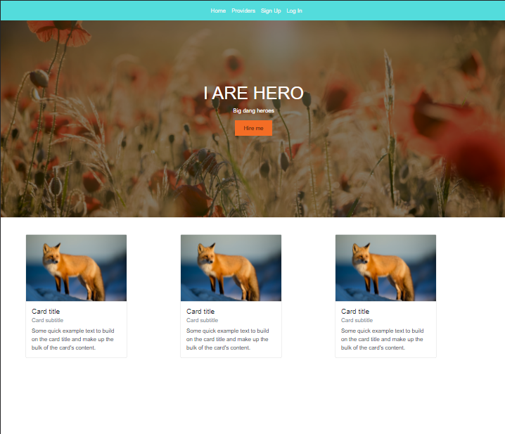

# SBA: HTML, CSS, and JavaScript
Layout of capstone front-end using: HTML, CSS, JavaScript, jQuery, and AJAX

## Badge

## Description

This layout includes a landing-page mock-up, a login and registration form with comprehensive validation, and a table of mock-data produced with an API call to the RandomUser API.

Tour live application [here.](https://lambent-bublanina-baea4c.netlify.app/views/signup.html)

## Table of Contents

- [Installation](#Installation)
- [Usage](#Usage)
- [Questions](#Questions)
- [License](#License)

## Installation

As a simple front-end mockup, not much is needed for installation.  Just clone repo and copy to a folder locally.

[Back to Table of Contents](#table-of-contents)

## Usage

Currently, usage is academic. However, you can test the form validation functionality by entering/not entering data in the fields.  You will see an error message and border around fields with invalid entries.  To clear the error, enter valid data and click the submit button again.  

After successful validation, you'll be directed to the 'Providers' page.

Landing Page:

Sign-Up Page:

Providers Page:

[Back to Table of Contents](#table-of-contents)

## Questions

Questions? You can reach me by email at jennifer.nelson242@gmail.com. Feel free to check out additional projects at [my GitHub profile](https://github.com/jnel-221).

[Back to Table of Contents](#table-of-contents)

## License

This project is licensed under the terms of the [MIT](./LICENSE) license.

[Back to Table of Contents](#table-of-contents)